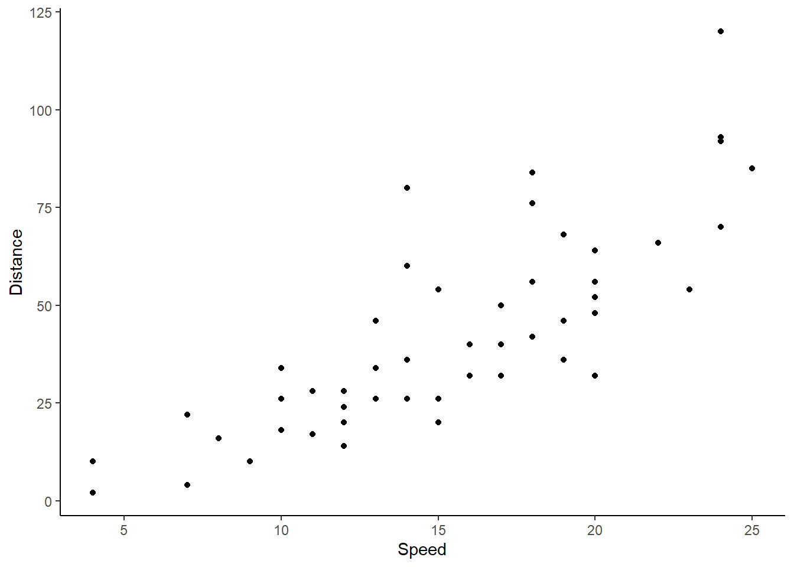
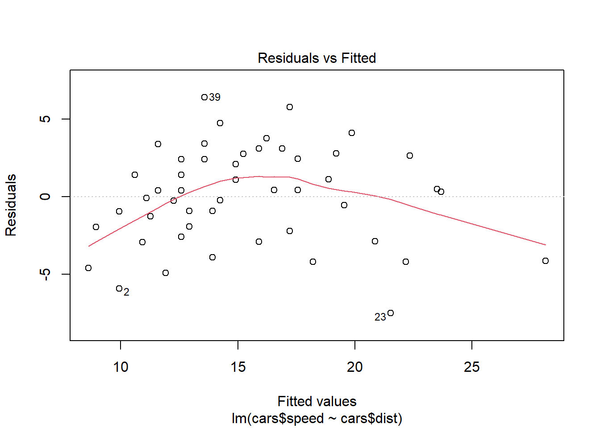
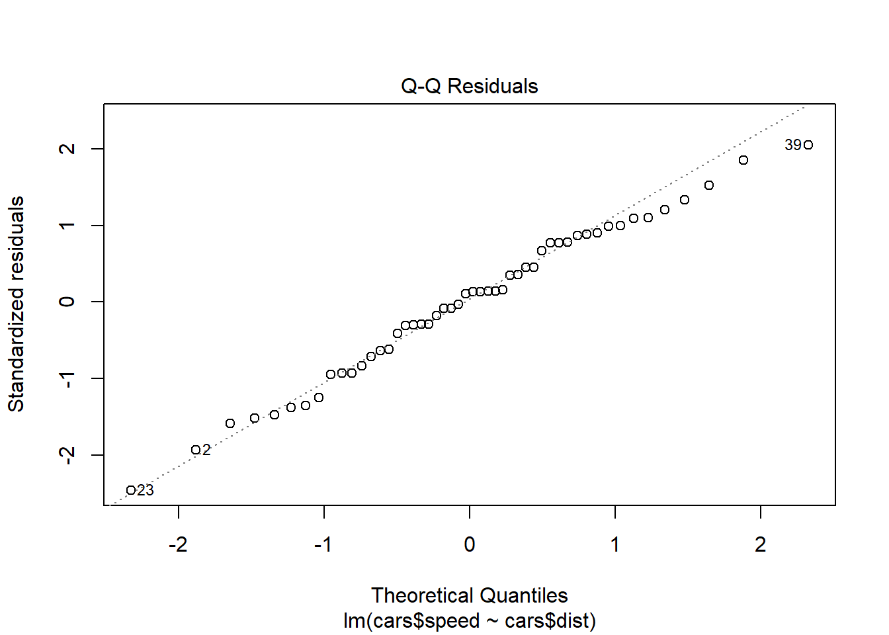
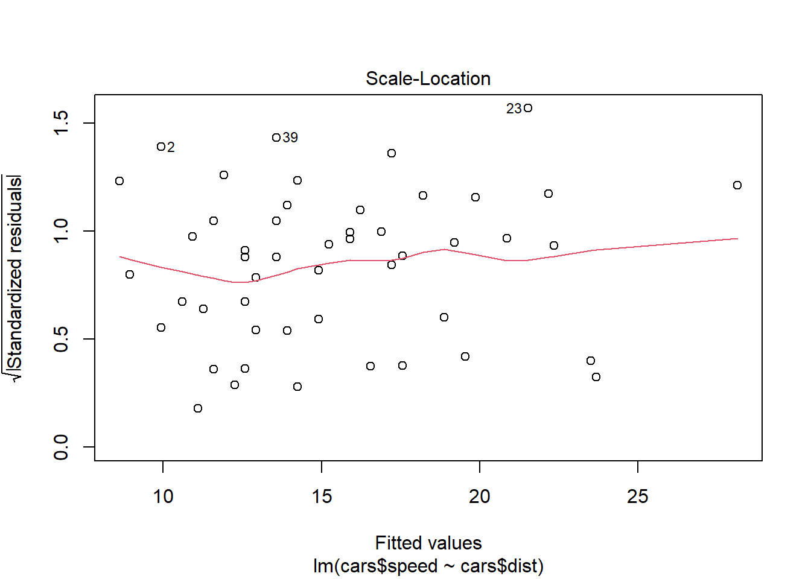
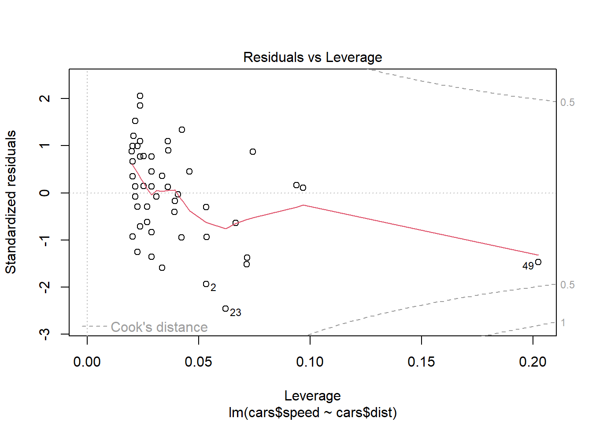

## YAML

The area at the top is the YAML command area which dictates some portions of the document. Additional and in-depth details for this portion can also be found at https://quarto.org/docs/reference/formats/opml.html#format-options

The list of commands include

-   title

-   author (name and information)

    -   name
    -   orcid

-   date

    -   today, now, last-modified
    -   or dates in these orders
        -   MM/dd/yyyy
        -   MM-dd-yyyy
        -   MM/dd/yy
        -   MM-dd-yy
        -   yyyy-MM-dd
        -   dd MM yyyy
        -   MM dd, yyyy
        -   YYYY-MM-DDTHH:mm:ssZ

-   format (or multiple formats)

    format:

    html: default

    pdf: default

-   toc: table of contents

-   code-fold: (true/false) - in an HTML format, the code is hidden in a drop down tab for the use to view or not view

-   toc-depth: specify the number of section levels to include in the table of contents

-   number-sections

You can set all R code chunk options here:

execute:

| Execute options | Actions              |
|-----------------|----------------------|
| echo            | true, false          |
| warning         | true, false          |
| eval            | true, false, \[...\] |
| output          | true, false, asis    |
| warning         | true, false          |
| error           | true, false          |
| include         | true, false          |
| cache           | true, false, refresh |
| freeze          | true, false, auto    |

: These options are listed after the execute: command with a tab inset followed by the option with a colon, space and the action.

## Template

Quarto enables you to weave together content and executable code into a finished document. To learn more about Quarto see <https://quarto.org>.

This template consists of generalized code that could be used as a reference when creating a new quarto document. Tips and tricks that were learned along the way have been included in the respective section. A lot of Rmarkdown notation can be utilized into quarto with previous Rmarkdown documents still able to be rendered when converted to a .qmd (to my knowledge).

## Formatting

### Headings and Page Breaks

Headings can be noted by using a specified number of #. A single \# indicates the *Header 1*, two \# indicates *Header 2*, three \# indicates *Header 3*, and so on.

Page breaks can be added manually into the text when editing the document in the source editor (not visual). The notation is `<br` which will create a manual page break between r objects.

### Font Changes

-   *Italic* is indicated through a word or set of words encased in \*

    `*word*`

-   **Bold** is indicated through a word or set of words encased by a set of double \*

    `**word**`

### Equations

Sample equation (inline): $R_{y}=\frac{\alpha*SSB_{y}}{1+\beta*SSB_{y}}$ Code: `$R_{y}=\frac{\alpha*SSB_{y}}{1+\beta*SSB_{y}}$`

Sample equation (own line): <br> 
$$
R_{y}=\frac{\alpha*SSB_{y}}{1+\beta*SSB_{y}}
$$ 
<br>

Greek letters notations:

Generalized notation - `$\alpha$`

| Greek Letter Spelling | Lowercase  | Capital    |
|-----------------------|------------|------------|
| alpha                 | $\alpha$   | A          |
| beta                  | $\beta$    | B          |
| gamma                 | $\gamma$   | $\Gamma$   |
| delta                 | $\delta$   | $\Delta$   |
| epsilon               | $\epsilon$ | E          |
| zeta                  | $\zeta$    | Z          |
| eta                   | $\eta$     | H          |
| theta                 | $\theta$   | $\Theta$   |
| kappa                 | $\kappa$   | K          |
| lambda                | $\lambda$  | $\Lambda$  |
| mu                    | $\mu$      | M          |
| nu                    | $\nu$      | N          |
| omicron               | $\omicron$ | O          |
| rho                   | $\rho$     | P          |
| sigma                 | $\sigma$   | $\Sigma$   |
| tau                   | $\tau$     | T          |
| upsilon               | $\upsilon$ | $\Upsilon$ |
| chi                   | $\chi$     | X          |
| psi                   | $\psi$     | $\Psi$     |
| iota                  | $\iota$    | I          |
| xi                    | $\xi$      | $\Xi$      |
| pi                    | $\pi$      | $\Pi$      |
| phi                   | $\phi$     | $\Phi$     |
| omega                 | $\omega$   | $\Omega$   |

### Other Helpful Functions for Equations

| Component   | Notation              | Output              |
|-------------|-----------------------|---------------------|
| Subscript   | `$*symbol*\_{sub}$`   | $symbol_{sub}$      |
| Superscript | `$*symbol*\^{sup}$`   | $symbol^{sup}$      |
| Fractions   | `$\frac{num}{denom}$` | $\frac{num}{denom}$ |
| Roots       | `$\sqrt{num}$`        | $\sqrt{num}$        |

For in-line text, superscript and subscript notation is different.

-   Superscript^2^ - `superscript^2^`

-   Subscript~2~ - `subscript~2~`

## Running Code

When you click the **Render** button a document will be generated that includes both content and the output of embedded code. You can embed code like this:


::: {.cell}

```{.r .cell-code}
x = 1 + 1
print(x)
```

::: {.cell-output .cell-output-stdout}

```
[1] 2
```


:::
:::


You can add options to executable code to remove the code chunk in the rendered document like this


::: {.cell}
::: {.cell-output .cell-output-stdout}

```
[1] 4
```


:::
:::


The `echo: false` option disables the printing of code (only output is displayed).

Other options include:

| Option  | Description                                                |
|---------|------------------------------------------------------------|
| eval    | Evaluate the code chunk                                    |
| output  | Include the source code in output                          |
| warning | Include warnings in the output                             |
| error   | Include errors in the output                               |
| include | Catch all for preventing any output code (code or results) |

### Figures

Inline references to figures can be generate by using the \@. If one referenced a figure in the test, you would need to label the figure in the R code chunk (@fig-test1).


::: {.cell .fig-cap-location-bottom}
::: {.cell-output-display}
{#fig-test1 width=672}
:::
:::


### Tables

Adding flextable objects into the document.


::: {.cell tbl-cap='Test1 table caption and example to add in.'}
::: {.cell-output-display}


```{=html}
<div class="tabwid"><style>.cl-186123a2{}.cl-1859281e{font-family:'Arial';font-size:11pt;font-weight:normal;font-style:normal;text-decoration:none;color:rgba(0, 0, 0, 1.00);background-color:transparent;}.cl-185c3e8c{margin:0;text-align:right;border-bottom: 0 solid rgba(0, 0, 0, 1.00);border-top: 0 solid rgba(0, 0, 0, 1.00);border-left: 0 solid rgba(0, 0, 0, 1.00);border-right: 0 solid rgba(0, 0, 0, 1.00);padding-bottom:5pt;padding-top:5pt;padding-left:5pt;padding-right:5pt;line-height: 1;background-color:transparent;}.cl-185c3e96{margin:0;text-align:left;border-bottom: 0 solid rgba(0, 0, 0, 1.00);border-top: 0 solid rgba(0, 0, 0, 1.00);border-left: 0 solid rgba(0, 0, 0, 1.00);border-right: 0 solid rgba(0, 0, 0, 1.00);padding-bottom:5pt;padding-top:5pt;padding-left:5pt;padding-right:5pt;line-height: 1;background-color:transparent;}.cl-185c5214{width:0.75in;background-color:transparent;vertical-align: middle;border-bottom: 1.5pt solid rgba(102, 102, 102, 1.00);border-top: 1.5pt solid rgba(102, 102, 102, 1.00);border-left: 0 solid rgba(0, 0, 0, 1.00);border-right: 0 solid rgba(0, 0, 0, 1.00);margin-bottom:0;margin-top:0;margin-left:0;margin-right:0;}.cl-185c521e{width:0.75in;background-color:transparent;vertical-align: middle;border-bottom: 1.5pt solid rgba(102, 102, 102, 1.00);border-top: 1.5pt solid rgba(102, 102, 102, 1.00);border-left: 0 solid rgba(0, 0, 0, 1.00);border-right: 0 solid rgba(0, 0, 0, 1.00);margin-bottom:0;margin-top:0;margin-left:0;margin-right:0;}.cl-185c521f{width:0.75in;background-color:transparent;vertical-align: middle;border-bottom: 0 solid rgba(0, 0, 0, 1.00);border-top: 0 solid rgba(0, 0, 0, 1.00);border-left: 0 solid rgba(0, 0, 0, 1.00);border-right: 0 solid rgba(0, 0, 0, 1.00);margin-bottom:0;margin-top:0;margin-left:0;margin-right:0;}.cl-185c5220{width:0.75in;background-color:transparent;vertical-align: middle;border-bottom: 0 solid rgba(0, 0, 0, 1.00);border-top: 0 solid rgba(0, 0, 0, 1.00);border-left: 0 solid rgba(0, 0, 0, 1.00);border-right: 0 solid rgba(0, 0, 0, 1.00);margin-bottom:0;margin-top:0;margin-left:0;margin-right:0;}.cl-185c5228{width:0.75in;background-color:transparent;vertical-align: middle;border-bottom: 1.5pt solid rgba(102, 102, 102, 1.00);border-top: 0 solid rgba(0, 0, 0, 1.00);border-left: 0 solid rgba(0, 0, 0, 1.00);border-right: 0 solid rgba(0, 0, 0, 1.00);margin-bottom:0;margin-top:0;margin-left:0;margin-right:0;}.cl-185c5229{width:0.75in;background-color:transparent;vertical-align: middle;border-bottom: 1.5pt solid rgba(102, 102, 102, 1.00);border-top: 0 solid rgba(0, 0, 0, 1.00);border-left: 0 solid rgba(0, 0, 0, 1.00);border-right: 0 solid rgba(0, 0, 0, 1.00);margin-bottom:0;margin-top:0;margin-left:0;margin-right:0;}</style><table data-quarto-disable-processing='true' class='cl-186123a2'><thead><tr style="overflow-wrap:break-word;"><th class="cl-185c5214"><p class="cl-185c3e8c"><span class="cl-1859281e">x</span></p></th><th class="cl-185c521e"><p class="cl-185c3e96"><span class="cl-1859281e">y</span></p></th></tr></thead><tbody><tr style="overflow-wrap:break-word;"><td class="cl-185c521f"><p class="cl-185c3e8c"><span class="cl-1859281e">1</span></p></td><td class="cl-185c5220"><p class="cl-185c3e96"><span class="cl-1859281e">2021</span></p></td></tr><tr style="overflow-wrap:break-word;"><td class="cl-185c521f"><p class="cl-185c3e8c"><span class="cl-1859281e">2</span></p></td><td class="cl-185c5220"><p class="cl-185c3e96"><span class="cl-1859281e">2022</span></p></td></tr><tr style="overflow-wrap:break-word;"><td class="cl-185c521f"><p class="cl-185c3e8c"><span class="cl-1859281e">3</span></p></td><td class="cl-185c5220"><p class="cl-185c3e96"><span class="cl-1859281e">2023</span></p></td></tr><tr style="overflow-wrap:break-word;"><td class="cl-185c5228"><p class="cl-185c3e8c"><span class="cl-1859281e">4</span></p></td><td class="cl-185c5229"><p class="cl-185c3e96"><span class="cl-1859281e">2024</span></p></td></tr></tbody></table></div>
```


:::
:::


<br>


::: {.cell tbl-cap='Test2 table caption to add in break.'}
::: {.cell-output-display}


```{=html}
<div class="tabwid"><style>.cl-1873c6ec{}.cl-186bc9e2{font-family:'Arial';font-size:11pt;font-weight:normal;font-style:normal;text-decoration:none;color:rgba(0, 0, 0, 1.00);background-color:transparent;}.cl-186f010c{margin:0;text-align:right;border-bottom: 0 solid rgba(0, 0, 0, 1.00);border-top: 0 solid rgba(0, 0, 0, 1.00);border-left: 0 solid rgba(0, 0, 0, 1.00);border-right: 0 solid rgba(0, 0, 0, 1.00);padding-bottom:5pt;padding-top:5pt;padding-left:5pt;padding-right:5pt;line-height: 1;background-color:transparent;}.cl-186f0116{margin:0;text-align:left;border-bottom: 0 solid rgba(0, 0, 0, 1.00);border-top: 0 solid rgba(0, 0, 0, 1.00);border-left: 0 solid rgba(0, 0, 0, 1.00);border-right: 0 solid rgba(0, 0, 0, 1.00);padding-bottom:5pt;padding-top:5pt;padding-left:5pt;padding-right:5pt;line-height: 1;background-color:transparent;}.cl-186f1156{width:0.75in;background-color:transparent;vertical-align: middle;border-bottom: 1.5pt solid rgba(102, 102, 102, 1.00);border-top: 1.5pt solid rgba(102, 102, 102, 1.00);border-left: 0 solid rgba(0, 0, 0, 1.00);border-right: 0 solid rgba(0, 0, 0, 1.00);margin-bottom:0;margin-top:0;margin-left:0;margin-right:0;}.cl-186f1157{width:0.75in;background-color:transparent;vertical-align: middle;border-bottom: 1.5pt solid rgba(102, 102, 102, 1.00);border-top: 1.5pt solid rgba(102, 102, 102, 1.00);border-left: 0 solid rgba(0, 0, 0, 1.00);border-right: 0 solid rgba(0, 0, 0, 1.00);margin-bottom:0;margin-top:0;margin-left:0;margin-right:0;}.cl-186f1158{width:0.75in;background-color:transparent;vertical-align: middle;border-bottom: 0 solid rgba(0, 0, 0, 1.00);border-top: 0 solid rgba(0, 0, 0, 1.00);border-left: 0 solid rgba(0, 0, 0, 1.00);border-right: 0 solid rgba(0, 0, 0, 1.00);margin-bottom:0;margin-top:0;margin-left:0;margin-right:0;}.cl-186f1160{width:0.75in;background-color:transparent;vertical-align: middle;border-bottom: 0 solid rgba(0, 0, 0, 1.00);border-top: 0 solid rgba(0, 0, 0, 1.00);border-left: 0 solid rgba(0, 0, 0, 1.00);border-right: 0 solid rgba(0, 0, 0, 1.00);margin-bottom:0;margin-top:0;margin-left:0;margin-right:0;}.cl-186f116a{width:0.75in;background-color:transparent;vertical-align: middle;border-bottom: 1.5pt solid rgba(102, 102, 102, 1.00);border-top: 0 solid rgba(0, 0, 0, 1.00);border-left: 0 solid rgba(0, 0, 0, 1.00);border-right: 0 solid rgba(0, 0, 0, 1.00);margin-bottom:0;margin-top:0;margin-left:0;margin-right:0;}.cl-186f116b{width:0.75in;background-color:transparent;vertical-align: middle;border-bottom: 1.5pt solid rgba(102, 102, 102, 1.00);border-top: 0 solid rgba(0, 0, 0, 1.00);border-left: 0 solid rgba(0, 0, 0, 1.00);border-right: 0 solid rgba(0, 0, 0, 1.00);margin-bottom:0;margin-top:0;margin-left:0;margin-right:0;}</style><table data-quarto-disable-processing='true' class='cl-1873c6ec'><thead><tr style="overflow-wrap:break-word;"><th class="cl-186f1156"><p class="cl-186f010c"><span class="cl-186bc9e2">x</span></p></th><th class="cl-186f1157"><p class="cl-186f0116"><span class="cl-186bc9e2">y</span></p></th></tr></thead><tbody><tr style="overflow-wrap:break-word;"><td class="cl-186f1158"><p class="cl-186f010c"><span class="cl-186bc9e2">5</span></p></td><td class="cl-186f1160"><p class="cl-186f0116"><span class="cl-186bc9e2">2021</span></p></td></tr><tr style="overflow-wrap:break-word;"><td class="cl-186f1158"><p class="cl-186f010c"><span class="cl-186bc9e2">6</span></p></td><td class="cl-186f1160"><p class="cl-186f0116"><span class="cl-186bc9e2">2022</span></p></td></tr><tr style="overflow-wrap:break-word;"><td class="cl-186f1158"><p class="cl-186f010c"><span class="cl-186bc9e2">7</span></p></td><td class="cl-186f1160"><p class="cl-186f0116"><span class="cl-186bc9e2">2023</span></p></td></tr><tr style="overflow-wrap:break-word;"><td class="cl-186f116a"><p class="cl-186f010c"><span class="cl-186bc9e2">8</span></p></td><td class="cl-186f116b"><p class="cl-186f0116"><span class="cl-186bc9e2">2024</span></p></td></tr></tbody></table></div>
```


:::
:::


## Modular Workflow

Quarto and Rmarkdown also allow the user to develop a template from a set of .qmd or .rmd documents from calling them in R chunks.

### Child Documents

One can combine a series of qmd files when the report is very long and would be easier to work with in sections rather than a single full report. In order to add one to the template document, the user would need to add it as an R chunk that includes an option of child = "child_file.qmd". Child files will be added as a new section into the template.


## Child Template Example

This document is designed to be built with the quarto template as an example child. It is implemented modularly to make the format easier to work with. Example R code is provided to test the functionality when adding it into the template document.

Function test:
$$
Z_{a,j} = F_{a,j} + M_{a,j}
$$

Linear model and results for R code test:

::: {.cell}
::: {.cell-output-display}
{width=672}
:::

::: {.cell-output-display}
{width=672}
:::

::: {.cell-output-display}
{width=672}
:::

::: {.cell-output-display}
{width=672}
:::
:::


If the user just wants the output of the R code from the child, the user would set an additional option of eval = T.

Testing the visual editor when adding citations [@base].

## References
